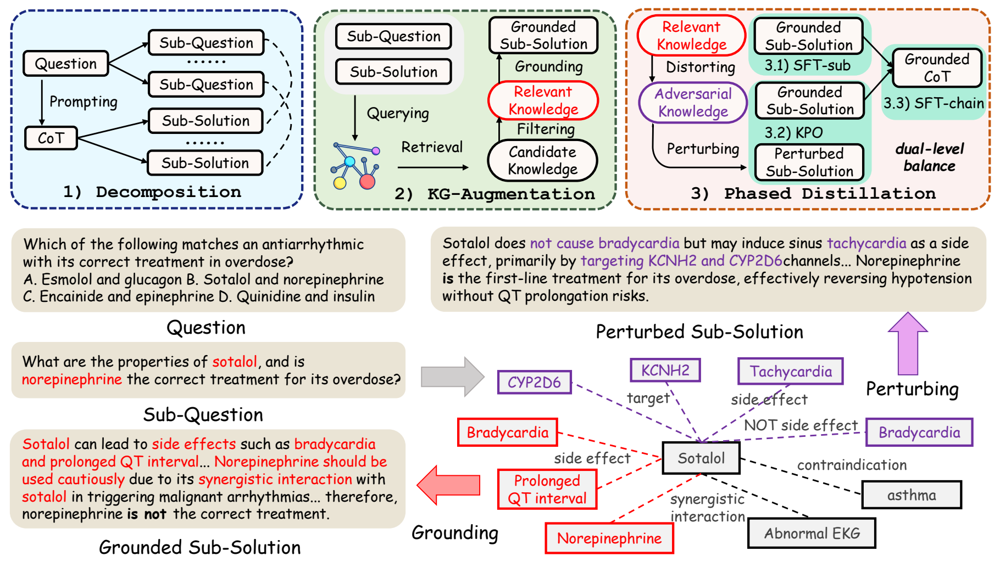
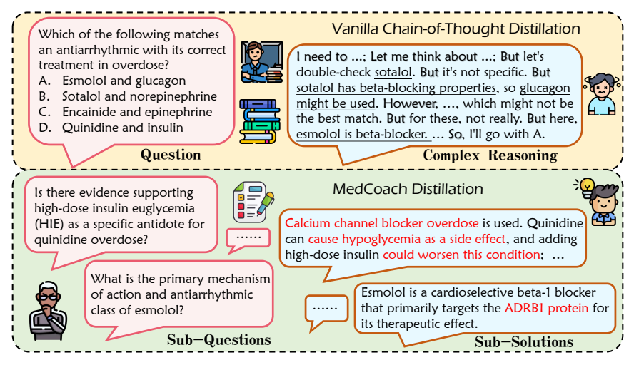

<div align="center">

# MedCoach

### Enhancing Medical Reasoning in LLMs via Knowledge Graph-Augmented Chain-of-Thought Distillation

Chuan Li · Ye Lyu · Chengyu Wang · Mingyuan Fan · Cen Chen

East China Normal University · Alibaba Group

[](https://aclanthology.org/2026.findings-acl.1683/)
[](https://aclanthology.org/2026.findings-acl.1683.pdf)

[Overview](#overview) · [Results](#results) · [Getting Started](#getting-started) · [Citation](#citation)

</div>

## Overview

**MedCoach teaches medical reasoning through grounded intermediate steps.** A coach decomposes complex questions, connects teacher reasoning to medical knowledge, and guides a student through progressively richer training signals.

<p align="center">
  
</p>
<p align="center"><em>Question decomposition, knowledge graph grounding, and phased distillation in MedCoach.</em></p>

- **Decompose:** align sub-questions with segments of the teacher's reasoning.
- **Ground:** retrieve relevant facts from PrimeKG and use them to refine intermediate solutions.
- **Distill:** train with grounded sub-solutions, knowledge-aware preferences, and complete reasoning chains.

<details>
<summary><strong>A closer look: from long reasoning chains to grounded sub-solutions</strong></summary>

<p align="center">
  
</p>
<p align="center"><em>A coach turns a complex medical question into focused sub-questions with knowledge-supported solutions.</em></p>

</details>

## Results

Selected results from Table 1 of the [paper](https://aclanthology.org/2026.findings-acl.1683.pdf), using Qwen2.5-7B-Instruct as the student. All values are accuracy (%); MMLU-Pro and GPQA use their medical subsets.

| Method | MedMCQA | MedQA | PubMedQA | MMLU-Pro | GPQA | Average |
|:--|--:|--:|--:|--:|--:|--:|
| Base model | 56.35 | 61.51 | 71.00 | 60.98 | 41.28 | 58.22 |
| CoT prompting | 58.32 | 62.60 | 68.40 | 64.00 | 44.40 | 59.54 |
| Standard CoT distillation | 59.17 | 65.15 | 73.70 | 64.10 | 50.26 | 62.48 |
| **MedCoach** | 58.76 | 73.66 | 75.30 | 65.15 | 52.05 | **64.98** |

## Getting Started

Run the commands below from the repository root on Linux with NVIDIA GPUs, Bash, GNU Make, and Conda.

### 1. Environment and knowledge graph

<details>
<summary><strong>Install the environment and build the PrimeKG index</strong></summary>

```bash
conda env create -f environment.yml
conda activate medcoach
```

Download `kg.csv` from [PrimeKG](https://github.com/mims-harvard/PrimeKG), place it at `data/kg.csv`, then build the embeddings and retrieval index:

```bash
make -f exps/pipeline.makefile kg_prepare
```

This uses `abhinand/MedEmbed-large-v0.1` and writes the index, metadata, and entity pool under `data/`.

</details>

### 2. Construct distillation data

<details>
<summary><strong>Generate teacher reasoning, ground sub-solutions, and create preference pairs</strong></summary>

Set `DEEPSEEK_API_KEY` in your environment or local `.env` file. The example uses a DeepSeek reasoner as the teacher and DeepSeek chat as the coach;

```bash
make -f exps/pipeline.makefile data \
  GPU_COUNT=1 \
  MODE=online \
  DATASETS=m1kself \
  ONLINE_TEACHER_MODEL_NAME=deepseek-reasoner \
  ONLINE_MODEL_NAME=deepseek-chat \
  GENERATION_PARAMS='{"max_tokens":4000}' \
  BACKEND_PARAMS='{"base_url":"https://api.deepseek.com/v1","require_all_responses":false}'
```

`m1kself` loads question prompts from [m1k-tokenized](https://huggingface.co/datasets/UCSC-VLAA/m1k-tokenized). The resulting training files are:

```text
outputs/grounding/deepseek-reasoner/m1kself/deepseek-chat/
├── subq_rewrite.jsonl    # Grounded sub-solutions
├── perturb_pref.jsonl    # Knowledge-aware preference pairs
└── chain_rewrite.jsonl   # Reconstructed reasoning chains
```

For local generation, use `MODE=local` and set `DATA_GEN_MODEL` to your local model path. See [pipeline.makefile](exps/pipeline.makefile) for the available options.

</details>

### 3. Train the student

The training curriculum has three stages. Pass each stage's saved model to the next stage.

| Stage | Training signal | Entry point |
|:--|:--|:--|
| **SFT-sub** | Grounded sub-question solutions | `exps/sft_deepspeed.sh` |
| **KPO** | Grounded responses paired with factual perturbations | `exps/dpo_deepspeed.sh` |
| **SFT-chain** | Complete knowledge-enhanced reasoning chains | `exps/sft_deepspeed.sh` |

<details>
<summary><strong>Three-stage training commands</strong></summary>

```bash
DATA_DIR=outputs/grounding/deepseek-reasoner/m1kself/deepseek-chat

# Stage 1: grounded sub-solutions
bash exps/sft_deepspeed.sh \
  --model_name Qwen/Qwen2.5-7B-Instruct \
  --train_dataset_name "$DATA_DIR/subq_rewrite.jsonl" \
  --epochs 1 --lr 1e-6 --global_batch_size 128

# Stage 2: knowledge-aware preference optimization
bash exps/dpo_deepspeed.sh \
  --model_name /path/to/stage1-model \
  --train_file_path "$DATA_DIR/perturb_pref.jsonl" \
  --epochs 1 --lr 5e-7 --beta 0.1 --global_batch_size 16

# Stage 3: complete reasoning chains
bash exps/sft_deepspeed.sh \
  --model_name /path/to/stage2-model \
  --train_dataset_name "$DATA_DIR/chain_rewrite.jsonl" \
  --epochs 5 --lr 1e-5 --weight_decay 1e-4 --global_batch_size 16
```

Replace the stage model paths with the saved directories printed by the training scripts. SFT models are saved under `outputs/sft/`; KPO models are saved under `outputs/dpo/`. Set `--gpu_count` to match your available GPUs.

</details>

### 4. Evaluate

<details>
<summary><strong>Run inference and scoring on the five medical QA benchmarks</strong></summary>

```bash
bash exps/inference_eval.sh \
  --model_path /path/to/final-model \
  --eval_data_path data/5datasets_eval.json
```

The evaluation entry point generates responses, extracts answers, and saves scored predictions and metrics under `outputs/eval/`.

</details>

## Code Guide

| Path | Role |
|:--|:--|
| `src/data_curation/` | Question decomposition, KG retrieval and grounding, and preference construction |
| `src/train/` | Supervised fine-tuning and preference optimization |
| `src/eval/` | Model inference, answer extraction, and benchmark scoring |
| `exps/` | Data, training, and evaluation recipes |

## Citation

```bibtex
@inproceedings{li-etal-2026-medcoach,
  title = "{M}ed{C}oach: Enhancing Medical Reasoning in {LLM}s via Knowledge Graph-Augmented Chain-of-Thought Distillation",
  author = "Li, Chuan and Lyu, Ye and Wang, Chengyu and Fan, Mingyuan and Chen, Cen",
  booktitle = "Findings of the Association for Computational Linguistics: ACL 2026",
  year = "2026",
  publisher = "Association for Computational Linguistics",
  url = "https://aclanthology.org/2026.findings-acl.1683/",
  doi = "10.18653/v1/2026.findings-acl.1683",
  pages = "33724--33743"
}
```

## Acknowledgments

We thank [m1](https://github.com/UCSC-VLAA/m1), [HuatuoGPT-o1](https://github.com/FreedomIntelligence/HuatuoGPT-o1), [MedReason](https://github.com/UCSC-VLAA/MedReason), and [PrimeKG](https://github.com/mims-harvard/PrimeKG) for their open research resources.